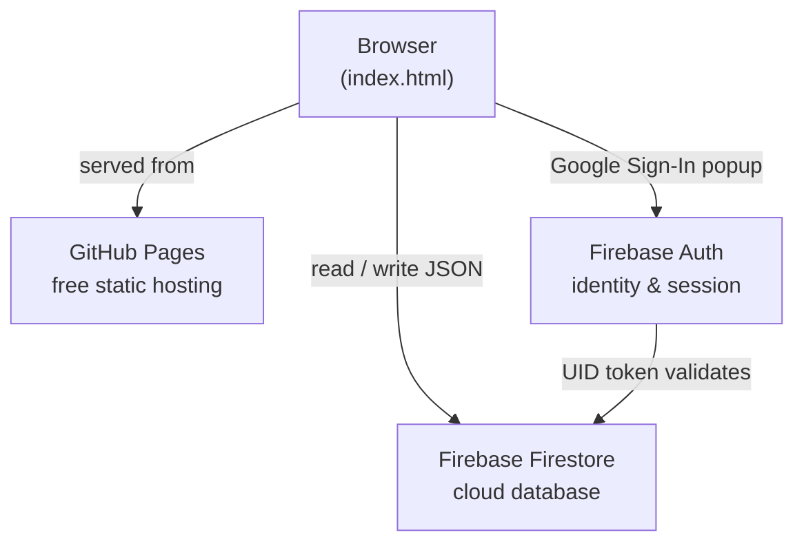
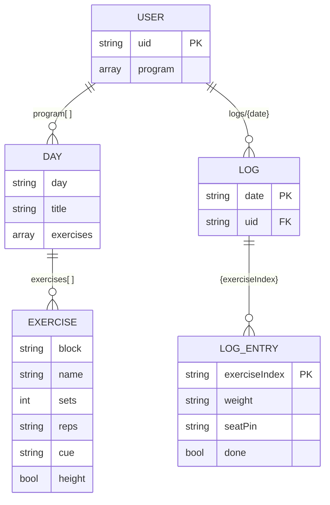
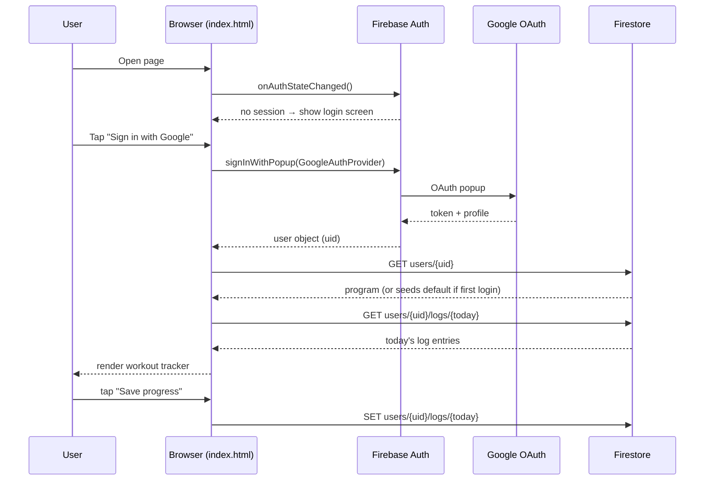

# ShirtOff Protocol v2

A cross-device gym workout tracker — one HTML file, Firebase backend, hosted free on GitHub Pages.

---

## Architecture



---

## Firestore path structure

```
users/                            ← collection
  {uid}                           ← document per user (program stored here)
    └── logs/                     ← subcollection
          {YYYY-MM-DD}            ← one document per calendar day
```

All data is scoped to the authenticated user's UID. No shared state, no server.

---

## Data model



---

## Document shapes

### `users/{uid}` — the user document

Stores the entire editable workout program as a single `program` field.

```json
{
  "program": [
    {
      "day": "Day 1",
      "title": "Push & Heavy Legs",
      "exercises": [
        {
          "block": "Warm-up",
          "name": "90/90 Hip Switches",
          "sets": 1,
          "reps": "5/side",
          "cue": "Improves hip mobility to save lower back",
          "height": false
        },
        {
          "block": "A",
          "name": "Machine Chest Press",
          "sets": 4,
          "reps": "8-10",
          "cue": "Primary chest driver; keep shoulders pinned back.",
          "height": true
        }
      ]
    }
  ]
}
```

- Created automatically on first login, seeded with the default 3-day program.
- Updated whenever the user saves changes from the **Edit Program** screen.
- `height: true` means the exercise shows a Seat/pin input field.

---

### `users/{uid}/logs/{YYYY-MM-DD}` — daily log

One document per calendar day. Keys are the **zero-based index** of the exercise in the day's flat `exercises` array. Warm-up exercises (block = `"Warm-up"`) are never logged.

```json
{
  "2": { "weight": "135", "height": "3",  "done": true  },
  "3": { "weight": "90",  "height": "5",  "done": true  },
  "4": { "weight": "70",  "height": "2",  "done": false },
  "5": { "weight": "180", "height": "7",  "done": true  },
  "6": { "weight": "45",  "height": "4",  "done": false }
}
```

Key `"2"` → `program[dayIndex].exercises[2]` (the first working exercise in Day 1 after two warm-ups).

---

## Auth & data flow



---

## Security rules

Paste into **Firebase Console → Firestore → Rules**. Each user can only read and write their own data.

```
rules_version = '2';
service cloud.firestore {
  match /databases/{database}/documents {
    match /users/{uid} {
      allow read, write: if request.auth != null && request.auth.uid == uid;
    }
    match /users/{uid}/logs/{logId} {
      allow read, write: if request.auth != null && request.auth.uid == uid;
    }
  }
}
```

---

## Stack & cost

| Layer    | Tool                          | Free tier limits                                  | Cost |
|----------|-------------------------------|---------------------------------------------------|------|
| Hosting  | GitHub Pages                  | Unlimited for public repos                        | $0   |
| Auth     | Firebase Auth (Google Sign-In)| Unlimited Google sign-ins                         | $0   |
| Database | Firebase Firestore (Spark)    | 1 GB storage · 50k reads/day · 20k writes/day     | $0   |

A typical workout session writes ~5–10 Firestore documents and reads ~2. The free tier is effectively unlimited for personal use.
